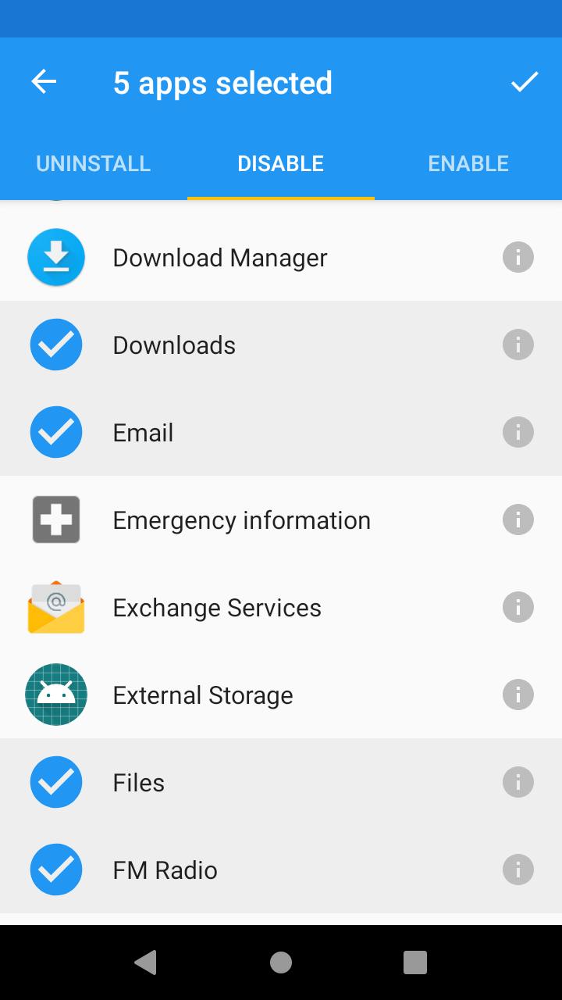

# Freezer


Many (especially older) Android devices ship with a lot of bloatware installed by the vendor.
Often at least some of this bloatware can be neither uninstalled nor disabled. However,
fortunately it is usually at least possible to get around this limitation using root access.

With root access, Android allows disabling many system apps using:

```shell
$ su -c 'pm disable com.example.app'
```

Freezer is a simple Android app that provides a nice-looking user interface for this.
It makes it easy to disable a large number of bloatware apps at once, and also re-enable
them when necessary.

There are many Android apps with similar functionality, but most of them have terrible
user interfaces and/or are closed-source (which should be a no-go for apps that require
root access).

The name "Freezer" comes from "freezing apps", which is how disabling system apps is often
called in the Android community (for some reason).

The screenshot on the right shows how some system apps are selected to be disabled. Note that typically you would
use Freezer to disable actual bloatware (like stupid games, ...), but I won't make any advertisements here.

## Building
Freezer is a fairly standard Android Gradle project and can be built using `./gradlew clean build`
(after providing the Android SDK location) or using Android Studio.

**Note:** Freezer requires root access to disable/enable system apps. In many cases,
you can use [Magisk](https://github.com/topjohnwu/Magisk) as an open-source option.
